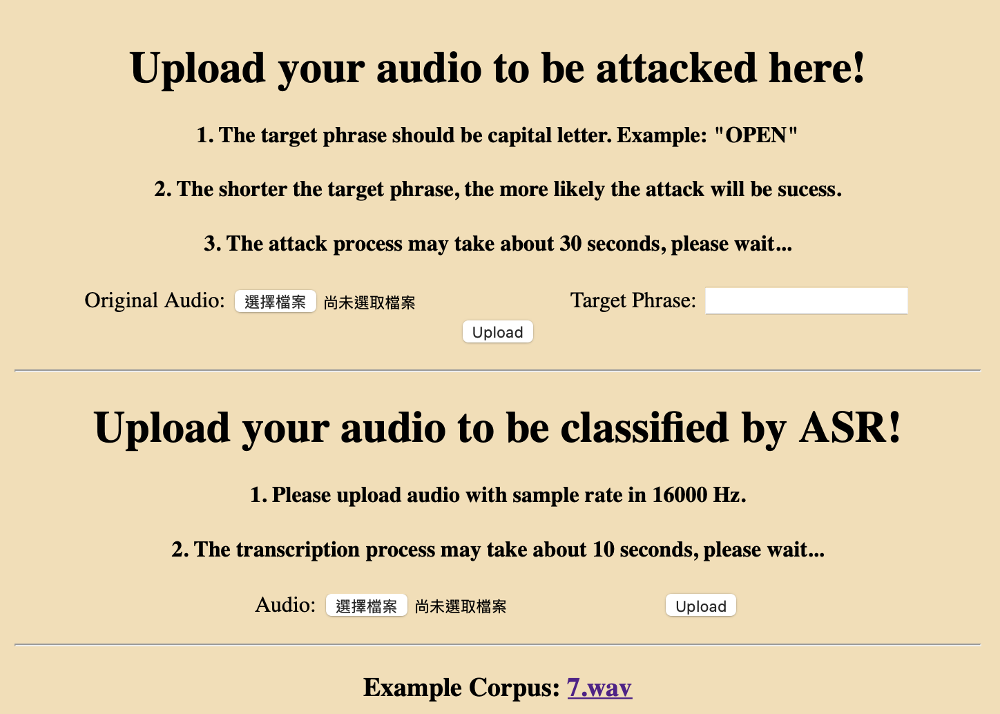

# Adversarial ASR Attack

A simple ML application with web interface using PyTorch and flask. Will be dockerized soon.

## Description

Generate adversarial audio example ([paper link](https://arxiv.org/pdf/1903.10346.pdf))

- Generate adversarial example:
    - Input: original audio / target sentence
    - Output: an audio which sounds the same but will be transcribed into target phrase.
- Automatic Speech Recognition
    - Input: An audio file.
    - Output: transcribed text.
    - It can be used to justify whether the adversarial attack is success.
- Example corpus: provided for user testing.
- Note that the length of target sentence shouldn't outscale the length of transcription of original audio.
- Demo


## Getting Started

### Installing

- Installation via dockerfile is under devlopment.
- Use `pip install -r requirements.txt` to install dependency.
- Note that `deepspeech_pytorch` needs manual installation. Check [here](https://github.com/SeanNaren/deepspeech.pytorch) for more information.
- Note that the art_toolbox used in the code is from [here](https://github.com/Trusted-AI/adversarial-robustness-toolbox), but several modification, including bug fixing have been made in my version of art_toolbox. Therefore, the [art_toolbox](https://github.com/william881218/adversarial-robustness-toolbox) forked in my repo is needed.

### Executing
- For CLI, use the following command to generate adversarial example:
```python
python3 generate_adv_exp.py [-h] [-i INPUT_PATH] [-t TARGET] [-o OUTPUT_PATH]
```
- For GUI, `python app.py` will run the service on the localhost with 9527 port.
    - The service will run automatically when docker is initiated.
